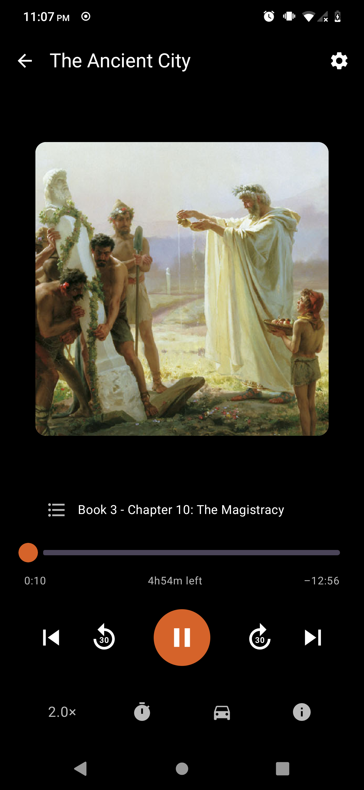
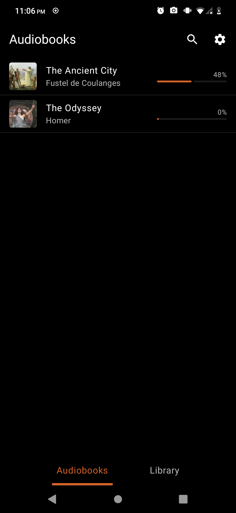
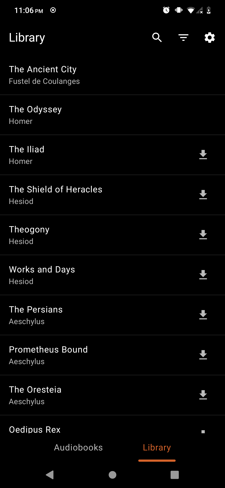
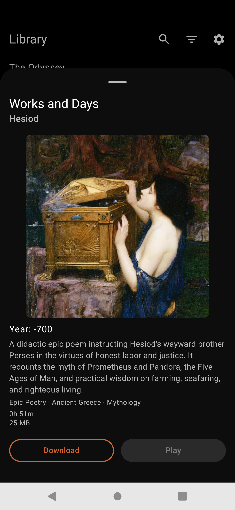
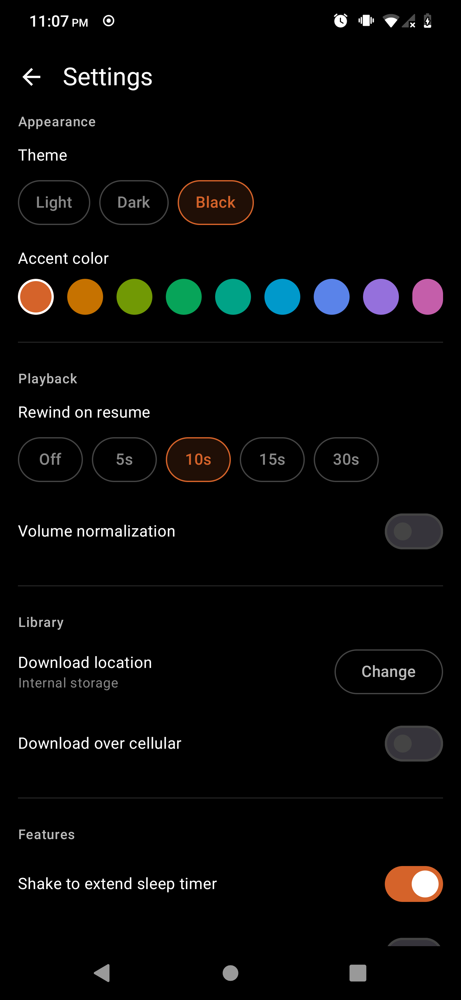

<h1 align="center">odyssey</h1>
<p align="center">An Android audiobook player for <a href="https://github.com/paulchambaz/iliad">Iliad</a>.</p>

<p align="center">
  <a href="https://f-droid.org/packages/xyz.chambaz.odyssey">
    
  </a>
</p>

<p align="center">
  
  
  
  
  
</p>

## About

Odyssey connects to a self-hosted Iliad server and lets you browse its audiobook
library, download books for offline listening, and pick up exactly where you
left off — on any device. Playback position syncs to the server every 30 seconds
and on every pause, so switching devices requires no manual action.

The player is chapter-aware: you can jump between chapters, seek within the
current one, and rewind automatically on resume. A sleep timer fades audio out
and stops playback; shaking the phone extends the timer without unlocking the
screen. Car mode enlarges controls, keeps the screen on, and can activate
automatically when a known head unit is detected over Bluetooth.

## Build

The project requires JDK 21, the Android SDK, and a running Iliad instance.
Set `ANDROID_HOME` and `JAVA_HOME` before building.

```sh
just build    # compile a debug APK
just run      # install and launch on a connected device
just test     # run unit tests
```

## License

<a href="https://www.gnu.org/licenses/gpl-3.0.en.html">
  
</a>

Odyssey is free software. You can use, study, modify and distribute it under the
terms of the [GNU General Public License](https://www.gnu.org/licenses/gpl-3.0.en.html),
version 3 or later.
